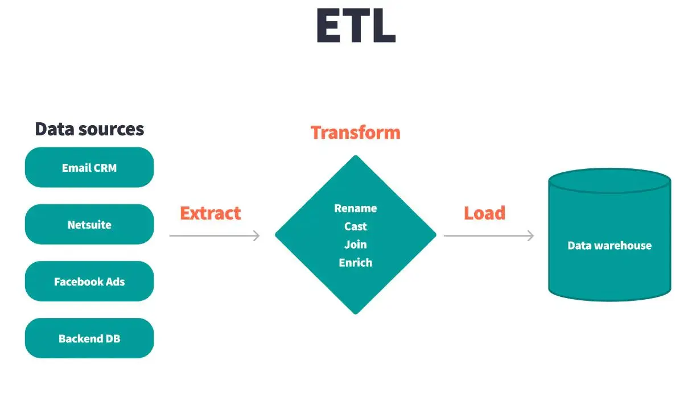

<div align="center">

# Universidad San Carlos de Guatemala

## Facultad de Ingeniería


### Ingeniería en Ciencias y Sistemas  

---

# **Práctica 1**  

## ETL con Python :

### De dataset crudo a tabla relacional lista para análisis  

---

### Estudiante

**Juan Carlos Maldonado Solórzano**

### Carné

**2012-226-87**

### Fecha de entrega

**25 de febrero de 2026**

</div>

---

# 0 Manual Técnico  

## 0.1 Introducción

En la actualidad, las organizaciones generan grandes volúmenes de información provenientes de múltiples fuentes heterogéneas. Para transformar estos datos en conocimiento estratégico que apoye la toma de decisiones, es necesario implementar procesos estructurados de integración y análisis.

El presente proyecto tiene como objetivo el diseño e implementación de un proceso ETL (Extract, Transform, Load) utilizando Python y Microsoft SQL Server, aplicado a un conjunto de datos relacionados con registros de vuelos.

A partir del archivo fuente dataset_vuelos_crudo.csv, se desarrolló un modelo multidimensional bajo el enfoque de Inteligencia de Negocios (Business Intelligence), permitiendo ejecutar consultas analíticas orientadas a la generación de indicadores clave para análisis operacional, financiero y estratégico.

Este proyecto integra conceptos de modelado dimensional, limpieza y transformación de datos, optimización de consultas SQL y validación de integridad referencial, cumpliendo con los requerimientos técnicos establecidos en la práctica.

## 0.2 Objetivos

### 0.2.1 Objetivo General

Diseñar e implementar un proceso ETL en Python que permita integrar datos de vuelos en un modelo multidimensional en SQL Server, habilitando consultas analíticas para la generación de información estratégica.

### 0.2.2 Objetivos Especificos

Extraer datos desde el archivo fuente dataset_vuelos_crudo.csv.

Aplicar procesos de transformación que incluyan limpieza, estandarización y homologación de datos.

Diseñar e implementar un modelo dimensional tipo estrella (Star Schema).

Crear dimensiones con claves sustitutas (surrogate keys).

Implementar una tabla de hechos con claves foráneas hacia las dimensiones.

Validar la correcta carga de datos mediante consultas SQL analíticas.

Generar indicadores relevantes como:

Número total de vuelos

Destinos más frecuentes

Distribución por género

Ingresos por aerolínea

Documentar técnicamente el proceso ETL y el modelo implementado.

## 0.2 Objetivo

El objetivo de este documento es describir detalladamente el proceso de diseño y creación de la base de datos del Data Warehouse para el análisis de vuelos.

---

## 1 Diseño y Creación de la Base de Datos  

### Data Warehouse – Análisis de Vuelos

La base de datos fue diseñada bajo un enfoque dimensional (modelo estrella) con el propósito de soportar consultas analíticas (OLAP), optimizar tiempos de respuesta y facilitar la toma de decisiones.

---

### 1.1 Alcance

- Diseño del modelo dimensional
- Definición de tablas de dimensiones
- Definición de tabla de hechos
- Definición de claves primarias y foráneas
- Definición de jerarquías
- Implementación de índices
- Justificación técnica del diseño

---

### 1.2 Tipo de Arquitectura

La base de datos fue diseñada utilizando el modelo:

⭐ **Esquema Estrella (Star Schema)**

Este modelo se caracteriza por:

- Una tabla central de hechos
- Varias tablas de dimensiones
- Relaciones uno a muchos entre dimensiones y hechos
- Uso de claves surrogate

Este enfoque es recomendado en sistemas de inteligencia de negocios (BI) y almacenes de datos (Data Warehouse).

---

### 1.3 Creación de la Base de Datos

### 1.3.1 Motor Utilizado

- Microsoft SQL Server
- Cliente de administración: DBeaver

---

### 1.3.2 Script de Creación

```

/* =====================================================
 * 
 * CREATE DATABASE BI_VUELOS;
 * 
   DIMENSION FECHA
   Jerarquía: Año → Mes → Día
===================================================== */

USE BI_VUELOS;

CREATE TABLE dim_fecha (
    fecha_key INT IDENTITY(1,1) PRIMARY KEY,
    fecha DATE NOT NULL,
    anio INT NOT NULL,
    mes INT NOT NULL,
    nombre_mes VARCHAR(20),
    dia INT NOT NULL,
    trimestre INT,
    dia_semana VARCHAR(20)
);

CREATE INDEX ix_dim_fecha_anio_mes
ON dim_fecha(anio, mes);


/* =====================================================
   DIMENSION AEROLINEA
===================================================== */

CREATE TABLE dim_aerolinea (
    aerolinea_key INT IDENTITY(1,1) PRIMARY KEY,
    airline_code VARCHAR(10),
    airline_name VARCHAR(100)
);

CREATE INDEX ix_dim_aerolinea_code
ON dim_aerolinea(airline_code);


/* =====================================================
   DIMENSION AEROPUERTO
===================================================== */

CREATE TABLE dim_aeropuerto (
    aeropuerto_key INT IDENTITY(1,1) PRIMARY KEY,
    codigo_aeropuerto VARCHAR(10)
);

CREATE INDEX ix_dim_aeropuerto_codigo
ON dim_aeropuerto(codigo_aeropuerto);


/* =====================================================
   DIMENSION PASAJERO
===================================================== */

CREATE TABLE dim_pasajero (
    pasajero_key INT IDENTITY(1,1) PRIMARY KEY,
    passenger_id VARCHAR(50),
    genero VARCHAR(20),
    edad INT,
    rango_edad VARCHAR(20),
    nacionalidad VARCHAR(50)
);

CREATE INDEX ix_dim_pasajero_id
ON dim_pasajero(passenger_id);


/* =====================================================
   DIMENSION PAGO
===================================================== */

CREATE TABLE dim_pago (
    pago_key INT IDENTITY(1,1) PRIMARY KEY,
    canal_venta VARCHAR(50),
    metodo_pago VARCHAR(50),
    moneda VARCHAR(10)
);


/* =====================================================
   DIMENSION CABINA
===================================================== */

CREATE TABLE dim_cabina (
    cabina_key INT IDENTITY(1,1) PRIMARY KEY,
    cabin_class VARCHAR(50),
    aircraft_type VARCHAR(100)
);


/* =====================================================
   DIMENSION ESTADO VUELO
===================================================== */

CREATE TABLE dim_estado (
    estado_key INT IDENTITY(1,1) PRIMARY KEY,
    estado_vuelo VARCHAR(50)
);


/* =====================================================
   TABLA DE HECHOS
===================================================== */

CREATE TABLE fact_vuelos (
    fact_key INT IDENTITY(1,1) PRIMARY KEY,

    fecha_salida_key INT NOT NULL,
    fecha_reserva_key INT NOT NULL,
    aerolinea_key INT NOT NULL,
    origen_key INT NOT NULL,
    destino_key INT NOT NULL,
    pasajero_key INT NOT NULL,
    pago_key INT NOT NULL,
    cabina_key INT NOT NULL,
    estado_key INT NOT NULL,

    duration_min INT,
    delay_min INT,
    ticket_price_usd DECIMAL(12,2),
    bags_total INT,
    bags_checked INT,

    FOREIGN KEY (fecha_salida_key) REFERENCES dim_fecha(fecha_key),
    FOREIGN KEY (fecha_reserva_key) REFERENCES dim_fecha(fecha_key),
    FOREIGN KEY (aerolinea_key) REFERENCES dim_aerolinea(aerolinea_key),
    FOREIGN KEY (origen_key) REFERENCES dim_aeropuerto(aeropuerto_key),
    FOREIGN KEY (destino_key) REFERENCES dim_aeropuerto(aeropuerto_key),
    FOREIGN KEY (pasajero_key) REFERENCES dim_pasajero(pasajero_key),
    FOREIGN KEY (pago_key) REFERENCES dim_pago(pago_key),
    FOREIGN KEY (cabina_key) REFERENCES dim_cabina(cabina_key),
    FOREIGN KEY (estado_key) REFERENCES dim_estado(estado_key)
);


/* =====================================================
   INDICES PARA OPTIMIZACION ANALITICA
===================================================== */

CREATE INDEX ix_fact_fecha
ON fact_vuelos(fecha_salida_key);

CREATE INDEX ix_fact_aerolinea
ON fact_vuelos(aerolinea_key);

CREATE INDEX ix_fact_destino
ON fact_vuelos(destino_key);

CREATE INDEX ix_fact_precio
ON fact_vuelos(ticket_price_usd);

```


### 1.3.3 Modelo Dimensional

#### 1.3.3.1  Estructura General

El modelo está compuesto por:

7 Tablas Dimensión
1 Tabla de Hechos

Tabla central:

fact_vuelos

Tablas dimensión:

dim_fecha
dim_aerolinea
dim_aeropuerto
dim_pasajero
dim_pago
dim_cabina
dim_estado

#### 1.3.3.2 Definición de Dimensiones

##### **1 Dimensión Fecha (dim_fecha)**

Propósito

Permite realizar análisis temporales (ventas por año, mes, día, trimestre).

Jerarquía Definida

Año → Mes → Día

| Campo      | Tipo         | Descripción      |
| ---------- | ------------ | ---------------- |
| fecha_key  | INT IDENTITY | Clave surrogate  |
| fecha      | DATE         | Fecha completa   |
| anio       | INT          | Año              |
| mes        | INT          | Mes              |
| nombre_mes | VARCHAR(20)  | Nombre del mes   |
| dia        | INT          | Día del mes      |
| trimestre  | INT          | Trimestre        |
| dia_semana | VARCHAR(20)  | Día de la semana |

Justificación

Se utiliza clave surrogate para evitar dependencia directa del valor fecha y permitir mayor flexibilidad.

##### **2 Dimensión Aerolínea (dim_aerolinea)**

Propósito

Permite análisis por compañía aérea.

| Campo         | Tipo         | Descripción         |
| ------------- | ------------ | ------------------- |
| aerolinea_key | INT IDENTITY | Clave surrogate     |
| airline_code  | VARCHAR(10)  | Código de aerolínea |
| airline_name  | VARCHAR(100) | Nombre de aerolínea |

##### **3 Dimensión Aeropuerto (dim_aeropuerto)**

Propósito

Permite análisis por ubicación (origen y destino).

| Campo             | Tipo         |
| ----------------- | ------------ |
| aeropuerto_key    | INT IDENTITY |
| codigo_aeropuerto | VARCHAR(10)  |

##### **4 Dimensión Pasajero (dim_pasajero)**

Propósito

Permite segmentación demográfica.

| Campo        | Tipo         |
| ------------ | ------------ |
| pasajero_key | INT IDENTITY |
| passenger_id | VARCHAR(50)  |
| genero       | VARCHAR(20)  |
| edad         | INT          |
| rango_edad   | VARCHAR(20)  |
| nacionalidad | VARCHAR(50)  |

##### **5 Dimensión Pago (dim_pago)**

Propósito

Permite análisis por canal y método de pago.

| Campo       | Tipo         |
| ----------- | ------------ |
| pago_key    | INT IDENTITY |
| canal_venta | VARCHAR(50)  |
| metodo_pago | VARCHAR(50)  |
| moneda      | VARCHAR(10)  |

##### **6  Dimensión Cabina (dim_cabina)**

Propósito

Permite análisis por tipo de clase y aeronave.

##### **7 Dimensión Estado (dim_estado)**

Propósito

Permite análisis por estado del vuelo (On Time, Cancelado, Retrasado).

#### 1.3.3.3 Tabla de Hechos

##### **1 fact_vuelos**

Granularidad

Un registro representa un vuelo individual.

Métricas

| Campo            | Tipo          | Descripción          |
| ---------------- | ------------- | -------------------- |
| duration_min     | INT           | Duración del vuelo   |
| delay_min        | INT           | Minutos de retraso   |
| ticket_price_usd | DECIMAL(12,2) | Precio del boleto    |
| bags_total       | INT           | Total equipaje       |
| bags_checked     | INT           | Equipaje documentado |

Claves Foráneas

- fecha_salida_key
- fecha_reserva_key
- aerolinea_key
- origen_key
- destino_key
- pasajero_key
- pago_key
- cabina_key
- estado_key

### 1.3.4 Claves Surrogate

Todas las dimensiones utilizan:

INT IDENTITY(1,1)

Justificación:

- Independencia del sistema origen

- Mejor rendimiento en joins

- Manejo adecuado de Slowly Changing Dimensions (SCD)

- Consistencia del modelo dimensional

### 1.3.5 Índices Implementados

Se crearon índices en la tabla de hechos para optimizar consultas analíticas frecuentes:

- fecha_salida_key

- aerolinea_key

- destino_key

- ticket_price_usd

### 1.3.6 Justificación Técnica

Los índices reducen el tiempo de ejecución en consultas que:

- Agrupan por fecha

- Filtran por aerolínea

- Analizan destinos frecuentes

- Filtran por rango de precios

### 1.3.7 Consideraciones Técnicas

- Modelo normalizado en dimensiones

- Tabla de hechos desnormalizada

- Optimizado para lectura (OLAP)

- Escalable para millones de registros

- Compatible con herramientas BI (Power BI, Tableau)

### 1.3.8 Conclusión

La base de datos fue diseñada bajo principios de modelado dimensional, utilizando un esquema estrella con claves surrogate y jerarquías temporales.

- Este diseño permite:

- Consultas analíticas eficientes
- Escalabilidad
- Fácil mantenimiento
- Soporte para toma de decisiones
- El modelo cumple con estándares de Data Warehouse y buenas prácticas de inteligencia de negocios.

## 2 Proceso ETL

proceso ETL (Extract, Transform, Load) utilizando Python, con el objetivo de integrar un dataset de vuelos en un modelo dimensional tipo Star Schema en SQL Server.

El proceso automatiza:

- Extracción de datos desde archivo CSV
- Transformación y limpieza de datos
- Carga hacia un Data Warehouse relacional

### 2.1 ARQUITECTURA GENERAL

🔹 Fuente de datos

Archivo: dataset_vuelos_crudo.csv
Ubicación: carpeta data/raw

🔹 Motor de Base de Datos

SQL Server
Base de datos: BI_VUELOS
Conexión mediante pyodbc

🔹 Modelo de datos

Modelo dimensional tipo Estrella (Star Schema):

Tablas dimensión:

dim_fecha
dim_aerolinea
dim_aeropuerto
dim_pasajero
dim_pago
dim_cabina
dim_estado
Tabla de hechos:
fact_vuelos

### 2.2 FASE 1: EXTRACCIÓN (EXTRACT)

Obtener datos crudos desde un archivo CSV y cargarlos en memoria usando Pandas.

```
df = pd.read_csv(csv_path)
df.columns = df.columns.str.strip().str.lower()
```

Qué hace esta fase:

Conecta a SQL Server.
Lee el archivo CSV.
Normaliza nombres de columnas.
Carga los datos en un DataFrame.

- Resultado:

Datos disponibles en memoria para su transformación.

### 2.3 FASE 2: TRANSFORMACIÓN (TRANSFORM)

Objetivo:

Limpiar, validar y estandarizar los datos antes de cargarlos.

#### 2.3.1  Conversión de fechas

```
df[col] = pd.to_datetime(df[col], errors="coerce", dayfirst=True)
```

- Convierte texto a formato datetime
- Maneja errores automáticamente

#### 2.3.2 Conversión numerica segura

```
df[col] = pd.to_numeric(df[col], errors="coerce")
```

- Evita fallos por valores inválidos
- Convierte texto a número

#### 2.3.3 Normalizacion de texto

```
df["origin_airport"] = df["origin_airport"].str.upper()
```

- Estandariza aeropuertos en mayúsculas

#### 2.3.4 Eliminación de registros críticos nulos

```
df = df.dropna(subset=[...])
```

- Elimina filas sin información clave
- Garantiza integridad referencial

#### 2.3.5 Cálculo de atributos derivados

```
rango = "18-29"
```

- Se calcula rango de edad dinámicamente
- Se calcula trimestre desde la fecha

**Resultado de la Transformación:**

Datos limpios
Tipos correctos
Sin nulos críticos
Listos para modelo dimensional


### 2.4 FASE 3: CARGA (LOAD)

La carga se realiza respetando la arquitectura dimensional.

#### 2.4.1 Carga de dimensiones

Se usa la técnica:

```
IF NOT EXISTS (...) INSERT ...
```

Ejemplo dim_fecha:

```
IF NOT EXISTS (SELECT 1 FROM dim_fecha WHERE fecha = ?)
INSERT INTO dim_fecha (...)
```

- Evita duplicados
- Implementa carga incremental básica

#### 2.4.2 Obtención de claves surrogate

Antes de insertar en la tabla de hechos:

```
cursor.execute("SELECT fecha_key FROM dim_fecha WHERE fecha = ?", fecha_salida)
```

- Se obtienen las PK surrogate
- Se garantiza integridad referencial

#### 2.4.3 Inserción en tabla de hechos

```
INSERT INTO fact_vuelos (...)
VALUES (?,?,?,?,?,?,?,?,?,?,?,?,?,?)
```

- Se insertan métricas numéricas
- Se insertan claves foráneas

### 2.5 CONTROL TRANSACCIONAL

```
conn.autocommit = False
conn.commit()
conn.rollback()
```

- Garantiza atomicidad
- Si ocurre error → rollback automático
- Evita corrupción de datos

### 2.6  MANEJO DE ERRORES

```
except Exception as e:
    conn.rollback()
```

- Captura excepciones
- Revierte cambios
- Muestra mensaje de error


### 2.7 RESULTADOS OBTENIDOS

- Integración exitosa del dataset
- Modelo estrella correctamente poblado
- Integridad referencial garantizada
- Proceso automatizado y reutilizable

### 2.8 CONCLUSIÓN TÉCNICA 

La aplicación desarrollada:

- Implementa correctamente las tres fases ETL
- Aplica limpieza y validación profesional
- Respeta arquitectura dimensional
- Controla transacciones
- Maneja errores



## 3 Consultas SQL analiticas

### 3.1 Consultas para validar carga

#### 3.1.1 Total de registros por tabla

```
SELECT 'dim_fecha' AS tabla, COUNT(*) AS total FROM dim_fecha
UNION ALL
SELECT 'dim_aerolinea', COUNT(*) FROM dim_aerolinea
UNION ALL
SELECT 'dim_aeropuerto', COUNT(*) FROM dim_aeropuerto
UNION ALL
SELECT 'dim_pasajero', COUNT(*) FROM dim_pasajero
UNION ALL
SELECT 'dim_pago', COUNT(*) FROM dim_pago
UNION ALL
SELECT 'dim_cabina', COUNT(*) FROM dim_cabina
UNION ALL
SELECT 'dim_estado', COUNT(*) FROM dim_estado
UNION ALL
SELECT 'fact_vuelos', COUNT(*) FROM fact_vuelos;
```

- Valida que todo cargó correctamente.

#### 3.1.2 Validar integridad referencial

```
SELECT COUNT(*) AS registros_sin_fecha
FROM fact_vuelos f
LEFT JOIN dim_fecha d ON f.fecha_salida_key = d.fecha_key
WHERE d.fecha_key IS NULL;
```

- Devuelve 0

### 3.2 Indicadores operativos

#### 3.2.1 Total de vuelos

```
SELECT COUNT(*) AS total_vuelos
FROM fact_vuelos;
```

#### 3.2.2 Vuelos por año

```
SELECT d.anio,
       COUNT(*) AS total_vuelos
FROM fact_vuelos f
JOIN dim_fecha d ON f.fecha_salida_key = d.fecha_key
GROUP BY d.anio
ORDER BY d.anio;
```

- Sirve para ver crecimiento anual.

#### 3.2.3 Vuelos por mes

```
SELECT d.anio,
       d.nombre_mes,
       COUNT(*) AS total_vuelos
FROM fact_vuelos f
JOIN dim_fecha d ON f.fecha_salida_key = d.fecha_key
GROUP BY d.anio, d.mes, d.nombre_mes
ORDER BY d.anio, d.mes;
```

- Detecta estacionalidad.

#### 3.2.4 Aerolineas con más vuelos

```
SELECT a.airline_name,
       COUNT(*) AS total_vuelos
FROM fact_vuelos f
JOIN dim_aerolinea a ON f.aerolinea_key = a.aerolinea_key
GROUP BY a.airline_name
ORDER BY total_vuelos DESC;
```

- Identifica líderes de mercado.

#### 3.2.5 Destinos más frecuentes

```
SELECT ap.codigo_aeropuerto,
       COUNT(*) AS total_llegadas
FROM fact_vuelos f
JOIN dim_aeropuerto ap ON f.destino_key = ap.aeropuerto_key
GROUP BY ap.codigo_aeropuerto
ORDER BY total_llegadas DESC;
```

- Detecta hubs importantes.

### 3.3 Indicadores de clientes

#### 3.3.1 Distribución por género

```
SELECT p.genero,
       COUNT(*) AS total_vuelos
FROM fact_vuelos f
JOIN dim_pasajero p ON f.pasajero_key = p.pasajero_key
GROUP BY p.genero;
```

- Segmentación de mercado.

#### 3.3.2 Distribución por rango de edad

```
SELECT p.rango_edad,
       COUNT(*) AS total_vuelos
FROM fact_vuelos f
JOIN dim_pasajero p ON f.pasajero_key = p.pasajero_key
GROUP BY p.rango_edad
ORDER BY total_vuelos DESC;
```

- Público objetivo principal

### 3.4 Indicadores Financieros
 
#### 3.4.1 Ingresos Totales

```
SELECT SUM(ticket_price_usd) AS ingresos_totales
FROM fact_vuelos;
```

#### 3.4.2 Ingresos por aerolinea

```
SELECT a.airline_name,
       SUM(f.ticket_price_usd) AS ingresos
FROM fact_vuelos f
JOIN dim_aerolinea a ON f.aerolinea_key = a.aerolinea_key
GROUP BY a.airline_name
ORDER BY ingresos DESC;
```

- Qué aerolínea genera más dinero.

#### 3.4.3 Ingresos por metodo de pago

```
SELECT p.metodo_pago,
       SUM(f.ticket_price_usd) AS ingresos
FROM fact_vuelos f
JOIN dim_pago p ON f.pago_key = p.pago_key
GROUP BY p.metodo_pago
ORDER BY ingresos DESC;
```

- Qué forma de pago domina el mercado.

### 3.5 Indicadores operativos avanzados

#### 3.5.1 Promedio de retraso por aerolínea

```
SELECT a.airline_name,
       AVG(f.delay_min) AS retraso_promedio
FROM fact_vuelos f
JOIN dim_aerolinea a ON f.aerolinea_key = a.aerolinea_key
GROUP BY a.airline_name
ORDER BY retraso_promedio DESC;
```

- Control de calidad operacional.

#### 3.5.2 Promedio de equipaje por vuelo

```
SELECT AVG(bags_total) AS promedio_bolsas
FROM fact_vuelos;
```

#### 3.5.3 Estados de vuelo

```
SELECT e.estado_vuelo,
       COUNT(*) AS total
FROM fact_vuelos f
JOIN dim_estado e ON f.estado_key = e.estado_key
GROUP BY e.estado_vuelo
ORDER BY total DESC;
```

- Tasa de cancelaciones / retrasos.

### 3.6 Consulta Ejecutica

```
Resumen general por año:

SELECT 
    d.anio,
    COUNT(*) AS total_vuelos,
    SUM(f.ticket_price_usd) AS ingresos_totales,
    AVG(f.delay_min) AS retraso_promedio
FROM fact_vuelos f
JOIN dim_fecha d ON f.fecha_salida_key = d.fecha_key
GROUP BY d.anio
ORDER BY d.anio;
```

- Consulta ejecutiva

## 4 Resultados Obtenidos

Extraer datos desde el archivo fuente dataset_vuelos_crudo.csv.

Aplicar procesos de transformación que incluyan limpieza, estandarización y homologación de datos.

Diseñar e implementar un modelo dimensional tipo estrella (Star Schema).

Crear dimensiones con claves sustitutas (surrogate keys).

Implementar una tabla de hechos con claves foráneas hacia las dimensiones.

Validar la correcta carga de datos mediante consultas SQL analíticas.

Generar indicadores relevantes como:

Número total de vuelos

Destinos más frecuentes

Distribución por género

Ingresos por aerolínea

Documentar técnicamente el proceso ETL y el modelo implementado.

## 5 Conclusiones

El desarrollo del proceso ETL permitió transformar datos crudos en información estructurada y analíticamente explotable.

La implementación de un modelo multidimensional tipo estrella facilita consultas rápidas y eficientes para la toma de decisiones, demostrando la importancia de:

Separar dimensiones y hechos.

Utilizar claves sustitutas.

Mantener integridad referencial.

Diseñar jerarquías temporales adecuadas.

La solución desarrollada es escalable, optimizable y adaptable a otros escenarios empresariales donde se requiera análisis estructurado de grandes volúmenes de información.
