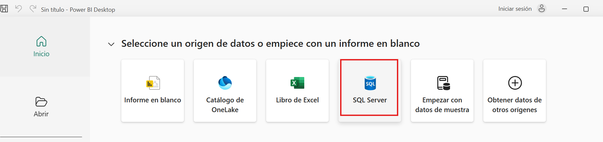
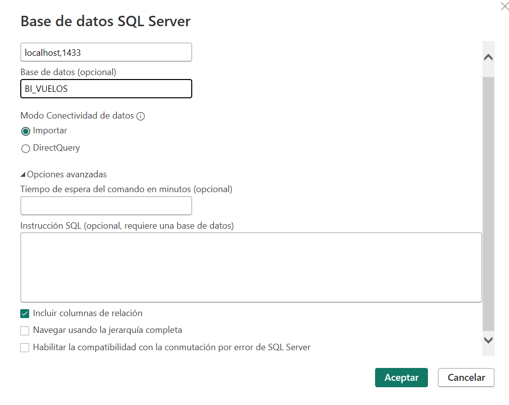
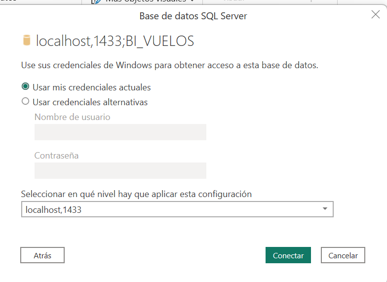
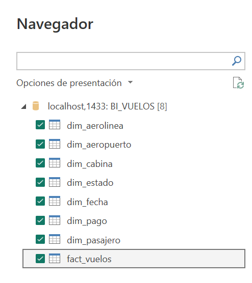
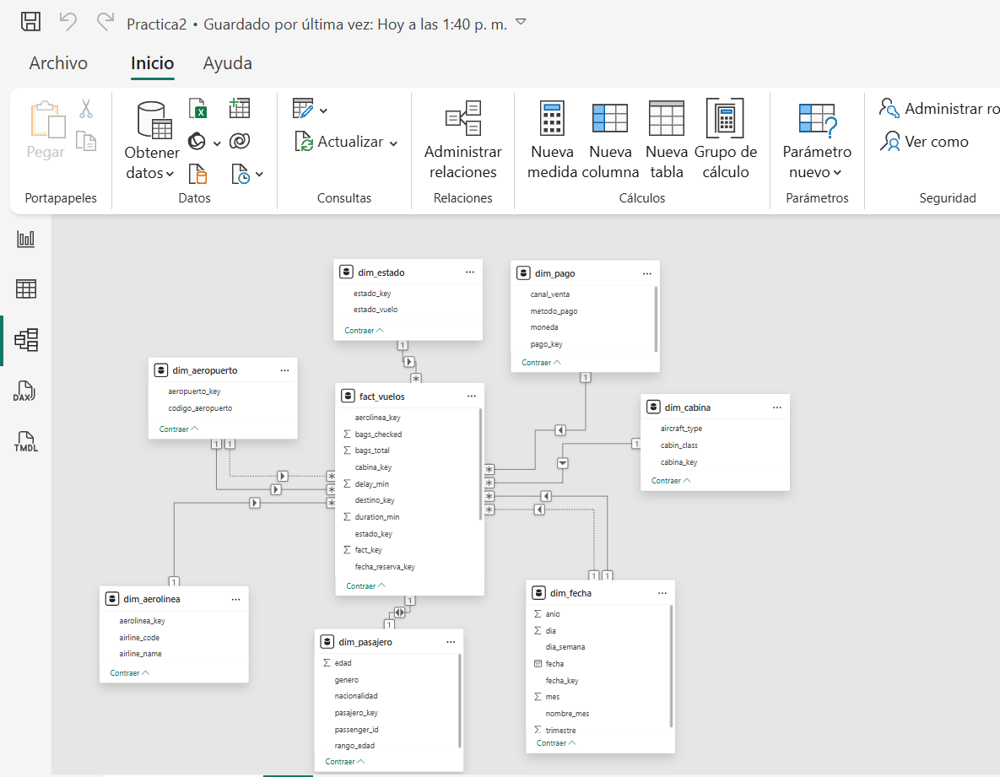
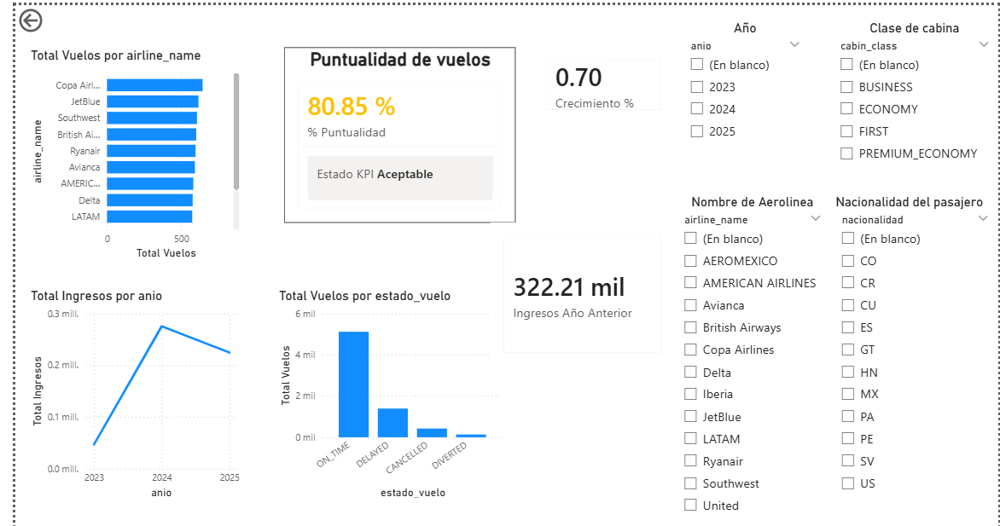
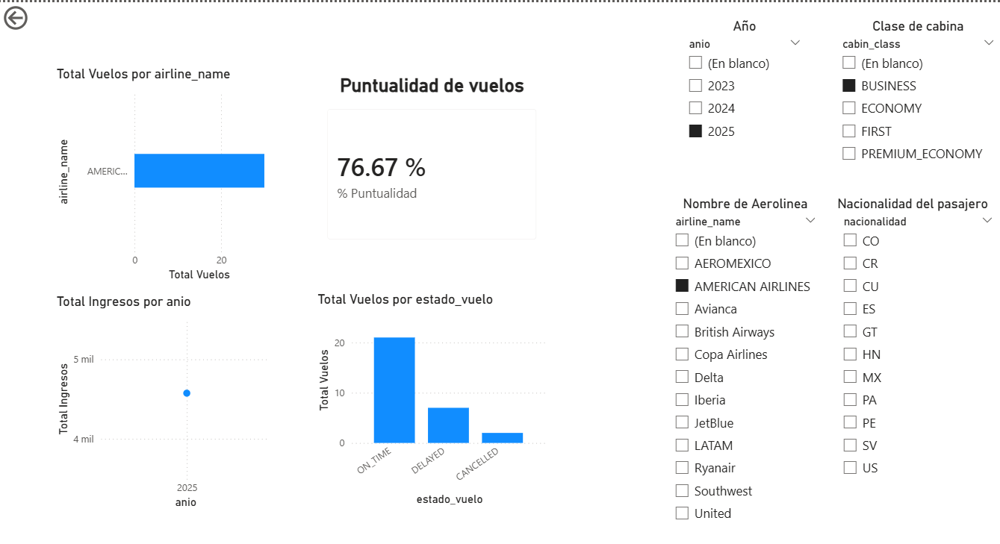
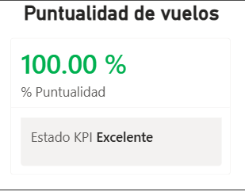
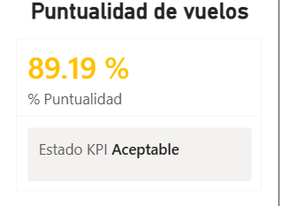
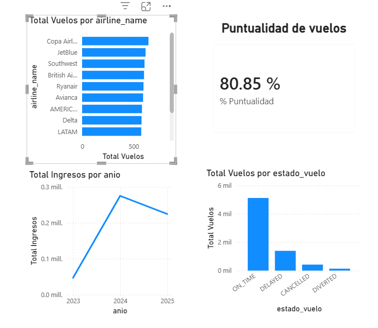

# Universidad San Carlos de Guatemala

## Facultad de Ingeniería

### Ingeniería en Ciencias y Sistemas  

---

# **Práctica 2**  

## Diseño De Dashboard y KPIs con Power BI

---

### Estudiante

**Juan Carlos Maldonado Solórzano**

### Carné

**2012-226-87**

### CICLO

**2026**

---

# Manual Técnico  

## 1 Introducción

En el entorno de la inteligencia empresarial, los datos generados por sistemas transaccionales como vuelos, pasajeros y pagos requieren ser transformados en información útil para la toma de decisiones.

En esta práctica se utiliza Microsoft Power BI Desktop conectado a Microsoft SQL Server para analizar la base de datos BI_VUELOS, la cual contiene información sobre operaciones aéreas, incluyendo aerolíneas, pasajeros, precios de boletos, retrasos y estados de vuelo.

El objetivo es construir un dashboard interactivo que permita evaluar el desempeño operativo y financiero mediante KPIs.

---

## 2 Objetivos

### 2.1 Objetivo General

Diseñar e implementar un dashboard interactivo en Power BI basado en la base de datos BI_VUELOS, utilizando un modelo tabular, medidas DAX y KPIs que permitan analizar el desempeño de los vuelos y apoyar la toma de decisiones.

## 2.2 Objetivo General

* Conectar Power BI con la base de datos BI_VUELOS.
* Construir un modelo tabular basado en esquema estrella.
* Implementar jerarquías en la dimensión fecha.
* Crear medidas DAX enfocadas en vuelos, ingresos y retrasos.
* Diseñar KPIs de desempeño operativo.
* Crear visualizaciones interactivas con filtros dinámicos.

## 3 Arquitectura

Tu base de datos ya está perfectamente diseñada en esquema estrella, lo cual es ideal para Power BI.

    🔹 Tabla de Hechos
            fact_vuelos
            Métricas:
            ticket_price_usd
            delay_min
            duration_min
            bags_total
    🔹 Dimensiones
            dim_fecha
            dim_aerolinea
            dim_aeropuerto
            dim_pasajero
            dim_pago
            dim_cabina
            dim_estado

## 4 Conexión a la Base de Datos (SQL Server)

    1 Abrir Microsoft Power BI Desktop
    2 Ir a:
        Obtener datos → SQL Server 

    3 Ingresar:
        Servidor
        Base de datos: BI_VUELOS
    4 Seleccionar:
        Modo Importar

    5 Cargar todas las tablas

## 5 Relaciones en Power BI

Power BI debe reconocer automáticamente las relaciones, pero siempre hay que validar:

| Tabla Hechos                 | Relación | Dimensión           |
| ---------------------------- | -------- | ------------------- |
| fact_vuelos.fecha_salida_key | →        | dim_fecha.fecha_key |
| fact_vuelos.aerolinea_key    | →        | dim_aerolinea       |
| fact_vuelos.origen_key       | →        | dim_aeropuerto      |
| fact_vuelos.destino_key      | →        | dim_aeropuerto      |
| fact_vuelos.pasajero_key     | →        | dim_pasajero        |
| fact_vuelos.estado_key       | →        | dim_estado          |

## 7 Jerarquía de Fecha

Crear en dim_fecha:

    Año
    └── Mes
        └── Día

Campos:

    anio
    nombre_mes
    dia

## 8 Medidas DAX (Importantes)

    🔹 1. Total Ingresos
            Total Ingresos = SUM(fact_vuelos[ticket_price_usd])
    🔹 2. Total Vuelos
            Total Vuelos = COUNT(fact_vuelos[fact_key])
    🔹 3. Retraso Promedio
            Retraso Promedio = AVERAGE(fact_vuelos[delay_min])
    🔹 4. Duración Promedio
            Duracion Promedio = AVERAGE(fact_vuelos[duration_min])
    🔹 5. Equipaje Promedio
            Equipaje Promedio = AVERAGE(fact_vuelos[bags_total])

## 9 KPI PRINCIPAL (Muy importante)

          6 KPI: Puntualidad de vuelos

                Vuelos Puntuales = 
                CALCULATE(
                    COUNT(fact_vuelos[fact_key]),
                    fact_vuelos[delay_min] <= 15
                )
                % Puntualidad = 
                DIVIDE([Vuelos Puntuales], [Total Vuelos])

          7 KPI con semáforo

                Estado KPI Puntualidad =
                SWITCH(
                    TRUE(),
                    [% Puntualidad] >= 0.9, "Excelente",
                    [% Puntualidad] >= 0.75, "Aceptable",
                    "Crítico"
                )

                🔴 Rojo → Crítico
                🟡 Amarillo → Aceptable
                🟢 Verde → Excelente

## 10 Dashboard (Diseño)

🔹 1. Gráfico de barras

        Eje: aerolinea_name
        Valor: Total Vuelos
        Permite ver qué aerolínea tiene más operaciones

🔹 2. Gráfico de líneas

        Eje: jerarquía de fecha
        Valor: Total Ingresos
        Analiza tendencias en el tiempo

🔹 3. KPI (Tarjeta)

        % Puntualidad
        Evalúa eficiencia operativa

🔹 4. Gráfico de columnas

        Eje: estado_vuelo
        Valor: Total Vuelos
        Cancelados, retrasados, etc.

🔹 5. Segmentadores (Filtros)

        Aerolínea
        Año
        Tipo de cabina
        Nacionalidad

## 11  Medidas Avanzadas (Mayor eficiencia)

    🔹 Crecimiento de ingresos

            Ingresos Año Anterior =
            CALCULATE([Total Ingresos], SAMEPERIODLASTYEAR(dim_fecha[fecha]))
            
            Crecimiento % =
            DIVIDE([Total Ingresos] - [Ingresos Año Anterior],
                [Ingresos Año Anterior])

## 12 Interpretación del Dashboard

Modelo BI_VUELOS para analizar:

* Aerolíneas más rentables
* Tendencias de ingresos
* Nivel de retrasos
* Comportamiento de pasajeros
* Eficiencia operativa

## 13 Decisiones Estratégicas

* Reducir retrasos en aerolíneas críticas
* Optimizar rutas con mayor demanda
* Ajustar precios según tendencia
* Mejorar experiencia del cliente

## 14  Capturas

1 Dashboard completo

2 KPI de puntualidad

3 Gráficos principales

## 15 Aplicación del Modelado Tabular

El modelado tabular se aplicó en la construcción del modelo de datos basado en un esquema estrella, donde la tabla de hechos fact_vuelos se relaciona con múltiples dimensiones como dim_fecha, dim_aerolinea y dim_estado.

En Power BI, este modelo se representa en la vista de relaciones, permitiendo la integración de datos mediante relaciones uno a muchos.

Además, se implementaron medidas DAX, jerarquías y segmentadores que aprovechan la estructura tabular para realizar análisis dinámicos e interactivos.

## 16 Conclusiones

* La base BI_VUELOS permite análisis multidimensional eficiente.
* El modelo estrella facilita consultas rápidas.
* Las medidas DAX permiten cálculos dinámicos avanzados.
* Los KPIs ayudan a identificar problemas operativos rápidamente.
* Power BI convierte datos en decisiones estratégicas.

## 17 Recomendaciones

* Crear más KPIs (ej: ingresos por pasajero)
* Usar tooltips personalizados
* Implementar seguridad (RLS)
* Optimizar modelo con columnas calculadas
