<div align="center">

# Universidad San Carlos de Guatemala

## Facultad de Ingeniería


### Ingeniería en Ciencias y Sistemas  

---

# **Proyecto 1**  

## Implementación del flujo completo de Microsoft con SSIS y SSAS en SQL Server

---

### Estudiante

**Juan Carlos Maldonado Solórzano**

### Carné

**2012-226-87**

### CICLO

**2026**

</div>

---

# 1 Manual Técnico  

## 1 Introducción

<p style="text-align: justify;">
En la actualidad, las organizaciones requieren sistemas de información eficientes que permitan transformar grandes volúmenes de datos en conocimiento útil para la toma de decisiones. En este contexto, el Business Intelligence se ha convertido en una herramienta fundamental para el análisis estratégico de la información.
</p>
<p style="text-align: justify;">
El presente proyecto tiene como finalidad la implementación de una solución completa de Business Intelligence para la empresa SG-Food, orientada al análisis de ventas e inventarios. Para ello, se desarrolló un flujo integral que abarca la extracción, transformación y carga de datos mediante SSIS, el diseño e implementación de un Data Warehouse bajo un modelo dimensional en SQL Server, y la creación de un modelo analítico multidimensional en SSAS.
</p>
<p style="text-align: justify;">
La solución integra datos provenientes de una fuente transaccional y archivos externos en Excel, permitiendo la validación y consolidación de la información. Finalmente, el modelo SSAS permite el análisis eficiente mediante cubos OLAP, medidas calculadas y KPIs, facilitando la exploración de la información desde múltiples perspectivas como cliente, producto, tiempo, ubicación y canal de venta.
</p>

## OBJETIVO GENERAL

<p style="text-align: justify;">
Diseñar e implementar una solución integral de Business Intelligence para la empresa SG-Food, mediante la construcción de un proceso ETL con SSIS, un Data Warehouse en SQL Server y un modelo analítico en SSAS, con el fin de optimizar el análisis de ventas e inventarios y mejorar la toma de decisiones estratégicas.
</p>

## OBJETIVOS ESPECÍFICOS

<p style="text-align: justify;">
Implementar un proceso ETL utilizando SQL Server Integration Services (SSIS) para la extracción, transformación y carga de datos provenientes de fuentes heterogéneas.
Diseñar e implementar un Data Warehouse en SQL Server bajo un modelo dimensional en esquema estrella, compuesto por tablas de hechos y dimensiones.
Integrar y consolidar datos provenientes de una base de datos transaccional y un archivo Excel como fuente complementaria de validación.
Desarrollar un modelo analítico en SQL Server Analysis Services (SSAS) mediante la creación de cubos OLAP, dimensiones, jerarquías y medidas calculadas.
Implementar KPIs y métricas de negocio que permitan evaluar el desempeño de ventas, rentabilidad, descuentos e inventarios.
Validar la consistencia de los datos mediante procesos de control de calidad y comparación entre el Data Warehouse y fuentes externas.
Facilitar el análisis de la información mediante estructuras multidimensionales que permitan la exploración eficiente de los datos desde diferentes perspectivas.
</p>

## Base de datos Transaccional

### CONECCION A LA BASE DE DATOS TRANSACCIONAL SGFoodOLTP

    •Base de datos transaccional SGFoodOLTP.
    •Tabla única dbo.TransaccionesVenta con 1000 registros.

### Credenciales de conexión

    Parametro valor.
    Servidor / Host 34.63.26.98
    Puerto 1433
    Base de datos SGFoodOLTP
    Usuario sgfood_reader
    Contraseña  SgFoodReader_2026!Sem2
    Tabla principal dbo.TransaccionesVenta

### Esquema de la tabla Tabla principal dbo.TransaccionesVenta

```

-- DROP SCHEMA dbo;

CREATE SCHEMA dbo;
-- SGFoodOLTP.dbo.TransaccionesVenta definition

-- Drop table

-- DROP TABLE SGFoodOLTP.dbo.TransaccionesVenta;

CREATE TABLE SGFoodOLTP.dbo.TransaccionesVenta (

TransaccionId bigint NOT NULL,
FechaTransaccion date NOT NULL,
ClienteId varchar(20) COLLATE SQL_Latin1_General_CP1_CI_AS NOT NULL,
ClienteNombre varchar(120) COLLATE SQL_Latin1_General_CP1_CI_AS NOT NULL,
SegmentoCliente varchar(40) COLLATE SQL_Latin1_General_CP1_CI_AS NOT NULL,
CanalVenta varchar(30) COLLATE SQL_Latin1_General_CP1_CI_AS NOT NULL,
Departamento varchar(60) COLLATE SQL_Latin1_General_CP1_CI_AS NOT NULL,
Municipio varchar(60) COLLATE SQL_Latin1_General_CP1_CI_AS NOT NULL,
ProductoSKU varchar(30) COLLATE SQL_Latin1_General_CP1_CI_AS NOT NULL,
ProductoNombre varchar(120) COLLATE SQL_Latin1_General_CP1_CI_AS NOT NULL,
Marca varchar(60) COLLATE SQL_Latin1_General_CP1_CI_AS NOT NULL,
Categoria varchar(60) COLLATE SQL_Latin1_General_CP1_CI_AS NOT NULL,
Subcategoria varchar(60) COLLATE SQL_Latin1_General_CP1_CI_AS NOT NULL,
Fabricante varchar(40) COLLATE SQL_Latin1_General_CP1_CI_AS NOT NULL,
CantidadVendida int NOT NULL,
ExistenciaAntesVenta int NOT NULL,
ExistenciaDespuesVenta int NOT NULL,
PrecioUnitario decimal(18,2) NOT NULL,
CostoUnitario decimal(18,2) NOT NULL,
DescuentoAplicado decimal(18,2) NOT NULL,
TotalLinea AS ([CantidadVendida]*[PrecioUnitario]-[DescuentoAplicado]) PERSISTED,
FechaRegistroUtc datetime2(0) DEFAULT sysutcdatetime() NOT NULL,
CONSTRAINT PK__Transacc__86A849FE3AC4CD3C PRIMARY KEY (TransaccionId)
);

CREATE NONCLUSTERED INDEX IX_TransaccionesVenta_Cliente ON SGFoodOLTP.dbo.TransaccionesVenta (ClienteId);

CREATE NONCLUSTERED INDEX IX_TransaccionesVenta_Fecha ON SGFoodOLTP.dbo.TransaccionesVenta (FechaTransaccion);

CREATE NONCLUSTERED INDEX IX_TransaccionesVenta_SKU ON SGFoodOLTP.dbo.TransaccionesVenta (ProductoSKU);

```

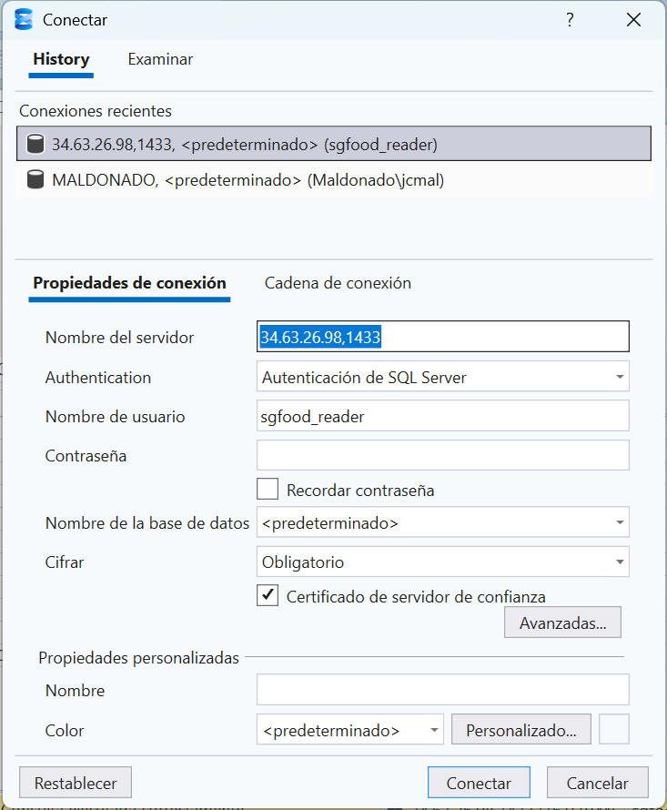

## Creacion de Data werehouse

### Tipo de Arquitectura

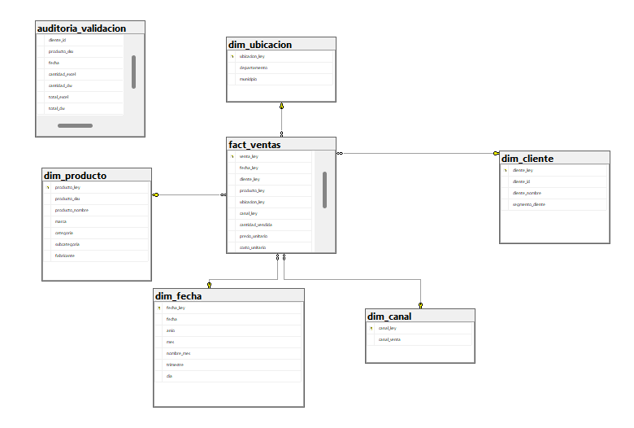

La base de datos fue diseñada utilizando el modelo:

**Esquema Estrella (Star Schema)**

Este modelo se caracteriza por:

- Una tabla central de hechos
- Varias tablas de dimensiones
- Relaciones uno a muchos entre dimensiones y hechos
- Uso de claves surrogate

Este enfoque es recomendado en sistemas de inteligencia de negocios (BI) y almacenes de datos (Data Warehouse).

---

### Creación de la Base de Datos

Crear la Base de Datos Local (SGFoodDW)

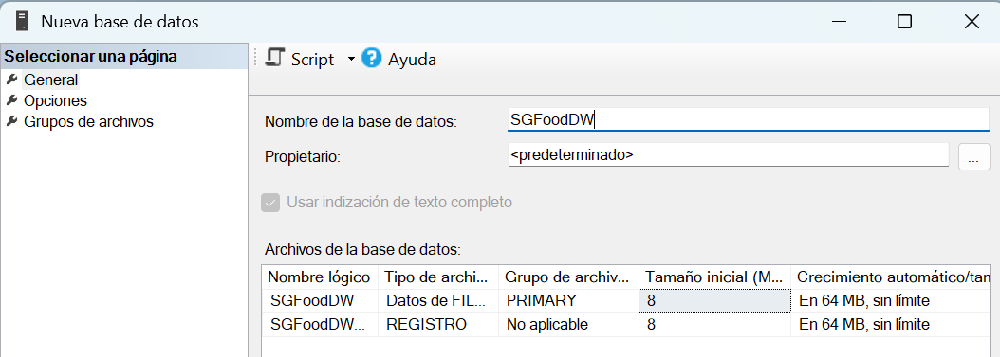

### Motor Utilizado

- Microsoft SQL Server

Modelo estrella:

                dim_fecha
                    |
    dim_cliente — fact_ventas — dim_producto
                    |
                dim_ubicacion
                    |
                dim_canal

---

### Diseño Formalmente Data Warehouse

**1. Dimensión Fecha**

Debe tener jerarquía:
Año → Mes → Día

Columnas:

    fecha_key (int)  ← surrogate key
    fecha (date)
    anio
    mes
    nombre_mes
    trimestre
    dia

**2. Dimensión Cliente**

    cliente_key (int) ← surrogate
    cliente_id (varchar)
    cliente_nombre
    segmento_cliente

**3. Dimensión Producto**

    producto_key (int)
    producto_sku
    producto_nombre
    marca
    categoria
    subcategoria
    fabricante

**4. Dimensión Ubicación**

    ubicacion_key (int)
    departamento
    municipio

**5. Dimensión Canal**

    canal_key (int)
    canal_venta

**6. Tabla de Hechos: fact_ventas**

Aquí solo métricas + llaves:

    fecha_key (FK)
    cliente_key (FK)
    producto_key (FK)
    ubicacion_key (FK)
    canal_key (FK)

    cantidad_vendida
    precio_unitario
    costo_unitario
    descuento
    total_venta
    existencia_antes
    existencia_despues

---

### Creacion de la Estructura del Data Warehouse

Creacion de las tablas correctamente con modelo dimensional.

### Crear Dimensiones

**1. Dimensión Fecha**

    CREATE TABLE dim_fecha (
        fecha_key INT PRIMARY KEY, // surrogate _key
        fecha DATE NOT NULL,        
        anio INT,
        mes INT,
        nombre_mes VARCHAR(20),
        trimestre INT,
        dia INT
    );

**2. Dimensión Cliente**

    CREATE TABLE dim_cliente (
        cliente_key INT IDENTITY(1,1) PRIMARY KEY, // surrogate _key
        cliente_id VARCHAR(20),                    // clave natural nk()
        cliente_nombre VARCHAR(120),
        segmento_cliente VARCHAR(40)
    );

**3. Dimensión Producto**

    CREATE TABLE dim_producto (
        producto_key INT IDENTITY(1,1) PRIMARY KEY, // surrogate _key
        producto_sku VARCHAR(30),                   // clave natural nk()
        producto_nombre VARCHAR(120),
        marca VARCHAR(60),
        categoria VARCHAR(60),
        subcategoria VARCHAR(60),
        fabricante VARCHAR(40)
    );

**4. Dimensión Ubicación**

    CREATE TABLE dim_ubicacion (
        ubicacion_key INT IDENTITY(1,1) PRIMARY KEY, // surrogate _key
        departamento VARCHAR(60), 
        municipio VARCHAR(60)
    );

**5. Dimensión Canal**

    CREATE TABLE dim_canal (
        canal_key INT IDENTITY(1,1) PRIMARY KEY, // surrogate _key
        canal_venta VARCHAR(30)
    );

**6. Crear Tabla de Hechos**

    CREATE TABLE fact_ventas (
        venta_key INT IDENTITY(1,1) PRIMARY KEY, // surrogate _key

        fecha_key INT NOT NULL,
        cliente_key INT NOT NULL,
        producto_key INT NOT NULL,
        ubicacion_key INT NOT NULL,
        canal_key INT NOT NULL,

        cantidad_vendida INT,
        precio_unitario DECIMAL(18,2),
        costo_unitario DECIMAL(18,2),
        descuento DECIMAL(18,2),
        total_venta DECIMAL(18,2),
        existencia_antes INT,
        existencia_despues INT,

        CONSTRAINT FK_fact_fecha FOREIGN KEY (fecha_key)
            REFERENCES dim_fecha(fecha_key),

        CONSTRAINT FK_fact_cliente FOREIGN KEY (cliente_key)
            REFERENCES dim_cliente(cliente_key),

        CONSTRAINT FK_fact_producto FOREIGN KEY (producto_key)
            REFERENCES dim_producto(producto_key),

        CONSTRAINT FK_fact_ubicacion FOREIGN KEY (ubicacion_key)
            REFERENCES dim_ubicacion(ubicacion_key),

        CONSTRAINT FK_fact_canal FOREIGN KEY (canal_key)
            REFERENCES dim_canal(canal_key)
    );

**Esquema:**

    SGFoodDW
    Tables
        dim_fecha
        dim_cliente
        dim_producto
        dim_ubicacion
        dim_canal
        fact_ventas

### Script de Creación (script_dw)

```

-- 1 Dimension fecha

CREATE TABLE dim_fecha (
    fecha_key INT PRIMARY KEY, -- surrogate _key
    fecha DATE NOT NULL,        
    anio INT,
    mes INT,
    nombre_mes VARCHAR(20),
    trimestre INT,
    dia INT
);

-- 2 Dimension cliente

CREATE TABLE dim_cliente (
    cliente_key INT IDENTITY(1,1) PRIMARY KEY, -- surrogate _key
    cliente_id VARCHAR(20),                    -- clave natural nk()
    cliente_nombre VARCHAR(120),
    segmento_cliente VARCHAR(40)
);

-- 3 Dimension producto

CREATE TABLE dim_producto (
    producto_key INT IDENTITY(1,1) PRIMARY KEY, -- surrogate _key
    producto_sku VARCHAR(30),                   -- clave natural nk()
    producto_nombre VARCHAR(120),
    marca VARCHAR(60),
    categoria VARCHAR(60),
    subcategoria VARCHAR(60),
    fabricante VARCHAR(40)
);

-- 4 Dimension Ubicacion

CREATE TABLE dim_ubicacion (
    ubicacion_key INT IDENTITY(1,1) PRIMARY KEY, -- surrogate _key
    departamento VARCHAR(60), 
    municipio VARCHAR(60)
);

-- 5 dimension canal

CREATE TABLE dim_canal (
    canal_key INT IDENTITY(1,1) PRIMARY KEY, -- surrogate _key
    canal_venta VARCHAR(30)
);

-- 6 Tabla de hechos.

CREATE TABLE fact_ventas (
    venta_key INT IDENTITY(1,1) PRIMARY KEY, -- surrogate _key

    fecha_key INT NOT NULL,
    cliente_key INT NOT NULL,
    producto_key INT NOT NULL,
    ubicacion_key INT NOT NULL,
    canal_key INT NOT NULL,

    cantidad_vendida INT,
    precio_unitario DECIMAL(18,2),
    costo_unitario DECIMAL(18,2),
    descuento DECIMAL(18,2),
    total_venta DECIMAL(18,2),
    existencia_antes INT,
    existencia_despues INT,

    CONSTRAINT FK_fact_fecha FOREIGN KEY (fecha_key)
        REFERENCES dim_fecha(fecha_key),

    CONSTRAINT FK_fact_cliente FOREIGN KEY (cliente_key)
        REFERENCES dim_cliente(cliente_key),

    CONSTRAINT FK_fact_producto FOREIGN KEY (producto_key)
        REFERENCES dim_producto(producto_key),

    CONSTRAINT FK_fact_ubicacion FOREIGN KEY (ubicacion_key)
        REFERENCES dim_ubicacion(ubicacion_key),

    CONSTRAINT FK_fact_canal FOREIGN KEY (canal_key)
        REFERENCES dim_canal(canal_key)
 );

```

### Estructura General

El modelo está compuesto por:

    5 Tablas Dimensión
    1 Tabla de Hechos

Tabla central:

    fact_ventas

Tablas dimensión:

    dim_fecha
    dim_cliente
    dim_producto
    dim_ubicacion
    dim_canal

### Tabla de Hechos

### **1 fact_ventas**

Granularidad es:

    Una fila en fact_ventas por cada TransaccionId

Un registro representa un vuelo individual.

Métricas

| Campo             | Tipo          | Descripción                 |
| ----------------  | ------------- | --------------------        |
| cantidad_vendida  | INT           | Cantidad vendida            |
| precio_unitario   | DECIMAL(18,2) | Precio por unidad           |
| costo_unitario    | DECIMAL(18,2) | Costo unitario              |
| descuento         | DECIMAL(18,2) | Descuento                   |
| total_venta       | DECIMAL(18,2) | Total de la venta           |
| existencia_antes  | INT           | Total de existencia antes   |
| existencia_despues| INT           | Total de existencia despues |

Claves Foráneas

- fecha_key
- cliente_key
- producto_key
- ubicacion_key
- canal_key

### Claves Surrogate

Todas las dimensiones utilizan:

INT IDENTITY(1,1)

Justificación:

- Independencia del sistema origen
- Mejor rendimiento en joins
- Manejo adecuado de Slowly Changing Dimensions (SCD)
- Consistencia del modelo dimensional

### Consideraciones Técnicas

- Modelo normalizado en dimensiones
- Tabla de hechos desnormalizada
- Optimizado para lectura (OLAP)
- Escalable para millones de registros
- Compatible con herramientas BI (Power BI, Tableau)

### Conclusión

La base de datos fue diseñada bajo principios de modelado dimensional, utilizando un esquema estrella con claves surrogate y jerarquías temporales.

- Este diseño permite:

- Consultas analíticas eficientes
- Escalabilidad
- Fácil mantenimiento
- Soporte para toma de decisiones
- El modelo cumple con estándares de Data Warehouse y buenas prácticas de inteligencia de negocios.

## Manual de SSIS en Visual Studio

El objetivo del proceso SSIS es:

* Extraer datos desde la fuente transaccional SGFoodOLTP y un archivo Excel
* Transformar y limpiar los datos
* Cargar un Data Warehouse en modelo estrella
* Validar la consistencia de los datos mediante comparación con Excel
* Generar una tabla de auditoría con resultados de calidad de datos

### Arquitectura General Del SSIS

    Control Flow
    │
    ├── Carga_Dim_Fecha
    ├── Carga_Dim_Cliente
    ├── Carga_Dim_Producto
    ├── Carga_Dim_Ubicacion
    ├── Carga_Dim_Canal
    ├── Carga_Fact_Ventas
    └── Validacion_Excel

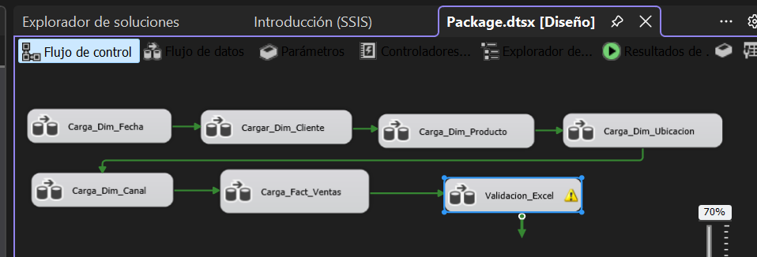

### Descripcion de flujos

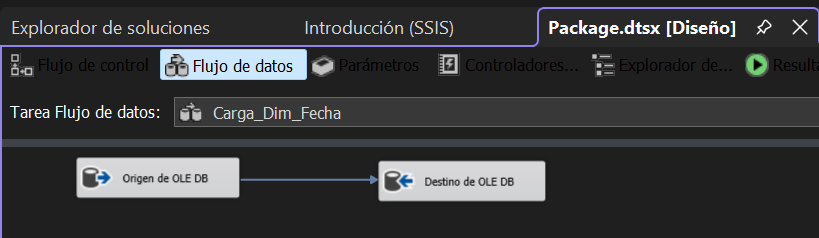

#### 1 Carga_Dim_Fecha

    Objetivo:

        Construir la dimensión de tiempo.

    Proceso:

        Generación de fechas
        Extracción de año, mes, trimestre, día

    Resultado:

        Tabla dim_fecha

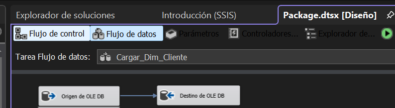

### 2 Carga_Dim_Cliente

    Fuente:

    SGFoodOLTP.dbo.TransaccionesVenta

    Transformaciones:

    Eliminación de duplicados
    Uso de DISTINCT
    Inserción de clientes únicos

    Resultado:

    dim_cliente

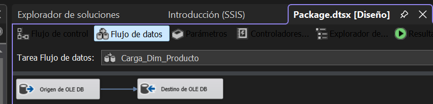

### 3 Carga_Dim_Producto

    Proceso:

        Extracción de productoSKU
        Normalización de marca, categoría
        Eliminación de duplicados

    Resultado:

        dim_producto

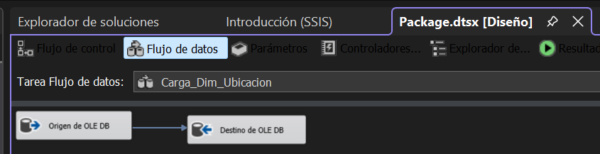

### 4 Carga_Dim_Ubicacion

    Proceso:

        Separación de departamento y municipio
        Eliminación de duplicados

    Resultado:

        dim_ubicacion

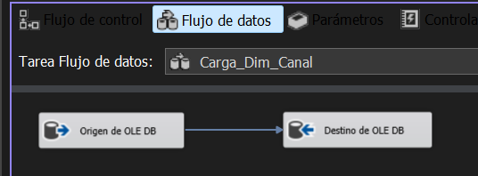

### 5 Carga_Dim_Canal

    Proceso:

        Extracción de CanalVenta
        Carga directa sin transformación compleja

    Resultado:

        dim_canal

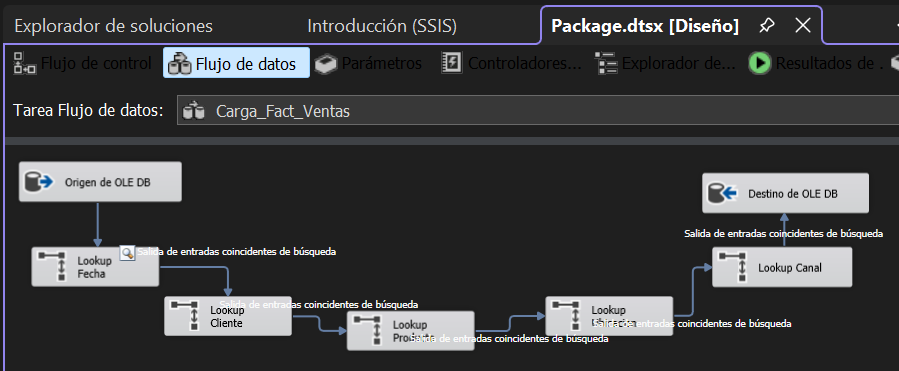

### 6 Carga_Fact_Ventas

    Proceso ETL:

     1. Extracción

        Desde:

        SGFoodOLTP.dbo.TransaccionesVenta

     2. Lookup (Claves sustitutas)

        Se realiza mapeo con dimensiones:

      | Dimensión | Campo         |
      | --------- | ------------- |
      | Cliente   | cliente_key   |
      | Producto  | producto_key  |
      | Ubicación | ubicacion_key |
      | Canal     | canal_key     |
      | Fecha     | fecha_key     |


     3. Transformaciones

        Cálculo de total_venta
        Conversión de tipos
        Limpieza de datos

     4. Carga

        Destino:

        fact_ventas

### Validacion de SGFood_Proyecto1_Muestra.xlsx (Excel)

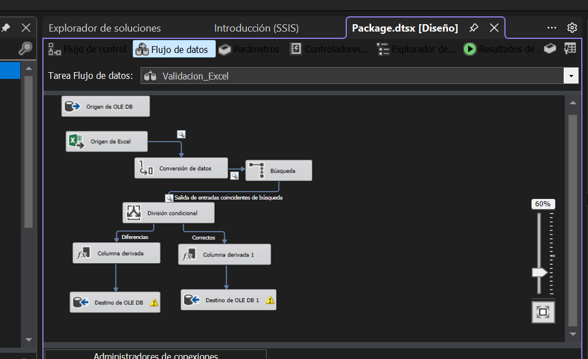

#### ¿QUÉ ES EL ARCHIVO EXCEL ?

    El archivo:

    SGFood_Proyecto1_Muestra.xlsx

    se utilizó como una fuente de datos heterogénea complementaria, independiente de la base transaccional SGFoodOLTP.

    Es importante:
    NO es la fuente principal, sino un punto de comparación.

#### ¿POR QUÉ SE UTILIZÓ?

    Se utilizó para cumplir un objetivo clave del proyecto:

    Validar la calidad e integridad de los datos cargados en el Data Warehouse

    En términos simples:
    La base SQL = datos oficiales cargados al DW
    El Excel = referencia externa de verificación

#### ¿QUÉ PROBLEMA RESUELVE?

    En sistemas reales, los datos pueden tener:

    * Errores de carga
    * Inconsistencias
    * Diferencias entre fuentes
    * Problemas en transformaciones ETL

    El Excel permite detectar estos problemas.

#### ¿CÓMO SE UTILIZÓ EN SSIS?

    Se implementó un flujo ETL específico llamado:

    Validacion_Excel

#### JUSTIFICACIÓN TÉCNICA

<p align="justify">
El archivo Excel fue utilizado como una fuente externa de validación dentro del proceso ETL, permitiendo comparar los datos cargados en el Data Warehouse contra una fuente independiente. Esta validación se implementó mediante transformaciones de tipo Lookup y Conditional Split en SSIS, lo que permitió clasificar los registros en correctos o con diferencias. Este enfoque garantiza la calidad de los datos BI.
</p>

**Objetivo:**

Validar la consistencia de los datos del Data Warehouse contra un archivo Excel externo.

**Fuente Excel:**

Archivo:

    SGFood_Proyecto1_Muestra.xlsx

**Columnas:**

    Fecha
    ClienteId
    ProductoSKU
    CantidadVendida
    ImporteNeto
    etc.

**Flujo ETL:**

    Excel Source
    ↓
    Lookup (fact_ventas + dimensiones)
    ↓
    Conditional Split
    ├── Correctos
    └── Diferencias

**LOOKUP**

Se utiliza para comparar:

    ClienteId
    ProductoSKU

Contra Data Warehouse.

**CONDITIONAL SPLIT**

Reglas:

    CantidadVendida != cantidad_vendida 
    || ImporteNeto != total_venta

**DERIVED COLUMN**

Se agrega columna:

    tipo_resultado
    "CORRECTO"
    "DIFERENCIA"

**Expresión:**

    (DT_STR, 20, 1252) "CORRECTOS"
    (DT_STR, 20, 1252) "DIFERENCIAS"

**TABLA DE SALIDA**

    auditoria_validacion

    Campos:

        cliente_id
        producto_sku
        cantidad_excel
        cantidad_dw
        total_excel
        total_dw
        tipo_resultado

    Creacion de tabla.

        /****** Object:  Table [dbo].[auditoria_validacion] ******/
        SET ANSI_NULLS ON
        GO
        SET QUOTED_IDENTIFIER ON
        GO
        CREATE TABLE [dbo].[auditoria_validacion](
            [cliente_id] [varchar](20) NULL,
            [producto_sku] [varchar](30) NULL,
            [fecha] [date] NULL,
            [cantidad_excel] [int] NULL,
            [cantidad_dw] [int] NULL,
            [total_excel] [decimal](18, 2) NULL,
            [total_dw] [decimal](18, 2) NULL,
            [tipo_resultado] [varchar](20) NULL
        ) ON [PRIMARY]
        GO

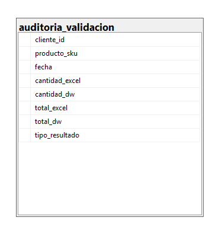

**RESULTADO**

    Registros comparados: ~1000
    Registros procesados: ~700 en auditoría
    Se identifican:
    coincidencias
    inconsistencias
    registros faltantes

**MANEJO DE ERRORES**

    Errores controlados:
    No matching rows en Lookup     → redirigidos
    Diferencias de tipos de datos  → Data Conversion
    Duplicados en cache            → DISTINCT en SQL

**VALIDACIONES REALIZADAS**

* Integridad de clientes
* Integridad de productos
* Consistencia de ventas
* Comparación Excel vs DW
* Control de calidad de datos

**CONCLUSIÓN TÉCNICA**

El proceso SSIS implementado permite:

* Integración de múltiples fuentes (SQL + Excel)
* Construcción de Data Warehouse en esquema estrella
* Aplicación de transformaciones ETL avanzadas
* Implementación de control de calidad de datos
* Generación de auditoría de consistencia

¿Qué debe hacer la Validacion_Excel?

Debe comparar:

    Data Warehouse (fact_ventas)
            VS
    Excel (SGFood_Proyecto1_Muestra)

## Manual de SSAS en Visual Studio

<p style="text-align: justify;">
El modelo analítico fue implementado utilizando SQL Server Analysis Services en su modalidad Multidimensional, ya que permite cumplir con los requerimientos del proyecto mediante la definición de dimensiones, jerarquías, medidas y relaciones. Este enfoque facilita el desarrollo, mejora el rendimiento y se alinea con lo moderno de Business Intelligence.
</p>

### Objetivo del modelo SSAS

<p style="text-align: justify;">
El objetivo del modelo analítico en SQL Server Analysis Services (SSAS) Multidimensional es permitir el análisis eficiente de las ventas e inventarios de SG-Food, a partir del Data Warehouse previamente implementado.
</p>
<p style="text-align: justify;">
Este modelo transforma el esquema relacional en un cubo OLAP, permitiendo consultas rápidas, agregaciones automáticas y análisis por dimensiones como cliente, producto, tiempo, ubicación y canal.
</p>

### Arquitectura del modelo SSAS

El modelo se basa en:

* Data Source: Data Warehouse SQL Server (fact_ventas y dimensiones)

* Data Source View (DSV): Modelo lógico del esquema estrella

* Cubo OLAP: VISTASGFoodDWSSAS

    Dimensiones:

        dim_fecha
        dim_cliente
        dim_producto
        dim_ubicacion
        dim_canal
        Medidas: ventas, costos, descuentos, inventario, margen

Creación del Data Source (Conexión)

    Paso a paso:

    Abrir Visual Studio

    Crear proyecto:

    Analysis Services Multidimensional and Data Mining Project

    En Solution Explorer:

    Click derecho en Data Sources → New Data Source

    Configuración:

    Provider:

    Microsoft OLE DB Provider for SQL Server

    Server:

    MALDONADO

    Database:

    SGFoodDW (DW final)

    Usuario:

    MALDONADO\jcmal

    Password:

**Test Connection → SUCCESS**

Data Source View (DSV)

    Crear DSV:

    Click derecho en Data Source Views

    “New Data Source View”

    Seleccionar todas las tablas:

    fact_ventas
    dim_fecha
    dim_cliente
    dim_producto
    dim_ubicacion
    dim_canal

    Relaciones (MUY IMPORTANTE)

    Verificar o crear:

    fact_ventas.fecha_key → dim_fecha.fecha_key
    fact_ventas.cliente_key → dim_cliente.cliente_key
    fact_ventas.producto_key → dim_producto.producto_key
    fact_ventas.ubicacion_key → dim_ubicacion.ubicacion_key
    fact_ventas.canal_key → dim_canal.canal_key

### Esto define el esquema estrella dentro de SSAS

Creación del Cubo SSAS

    Paso a paso:

    Click derecho en Cubes → New Cube

    Seleccionar:

    “Use existing tables”

    Seleccionar tabla de hechos:

    fact_ventas

    Medidas del cubo

    Seleccionar estas medidas:

    Ventas
    cantidad_vendida (SUM)
    total_venta (SUM)
    Costos
    costo_unitario (SUM)
    Descuentos
    descuento (SUM)
    Inventario
    existencia_antes
    existencia_despues
    Medidas calculadas (MDX Script)

Dimensiones del cubo

**Dimensión Fecha**

    Jerarquía:

    Año
    Mes
    Día

    Propiedades:

    fecha_key como clave
    jerarquía natural

**Dimensión Cliente**

    Jerarquía:

    SegmentoCliente
    ClienteNombre

**Dimensión Producto**

    Jerarquía:

    Categoria
    Subcategoria
    Marca
    ProductoNombre

**Dimensión Ubicación**

    Jerarquía:

    Departamento
    Municipio

**Dimensión Canal**

    CanalVenta (simple)

        Relaciones en el cubo

    Configurar:

    Dimensiones → Measure Group: fact_ventas

    Relationship type:

    Regular relationship

    Granularity:

    Match por surrogate keys (_key)

    Procesamiento del cubo

    Paso final:
    Click derecho en cubo
    Process
    Seleccionar:
    Process Full

 Resultado esperado:

Cube processed successfully
No errors

Validación del modelo

### Conclusión técnica

<p style="text-align: justify;">
El modelo SSAS implementado para SG-Food permite el análisis multidimensional de las ventas e inventarios mediante la construcción de un cubo OLAP basado en un esquema estrella previamente diseñado en el Data Warehouse.
</p>
<p style="text-align: justify;">
Este modelo facilita la navegación por jerarquías de tiempo, producto, cliente, ubicación y canal, permitiendo la generación de métricas clave como ventas totales, márgenes y promedios.
</p>
<p style="text-align: justify;">
La solución mejora significativamente el rendimiento analítico en comparación con consultas directas sobre la base transaccional, cumpliendo con los objetivos del proyecto de Business Intelligence.
</p>

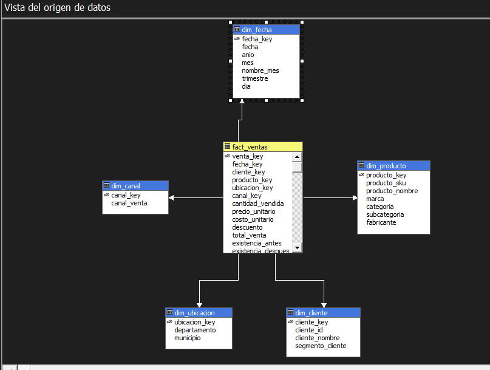

### MEDIDAS SSAS (MDX)

Ve a:
 Calculations → Script MDX

    1.1 Ventas Totales (Base)
    CREATE MEMBER CURRENTCUBE.[Measures].[Ventas Totales] AS
    SUM([Measures].[total_venta]);

    1.2 Cantidad Vendida Total
    CREATE MEMBER CURRENTCUBE.[Measures].[Cantidad Total Vendida] AS
    SUM([Measures].[cantidad_vendida]);

    1.3 Costo Total
    CREATE MEMBER CURRENTCUBE.[Measures].[Costo Total] AS
    SUM([Measures].[costo_unitario] * [Measures].[cantidad_vendida]);

    1.4 Descuento Total
    CREATE MEMBER CURRENTCUBE.[Measures].[Descuento Total] AS
    SUM([Measures].[descuento]);

    1.5 Margen Bruto
    CREATE MEMBER CURRENTCUBE.[Measures].[Margen Bruto] AS
    [Measures].[Ventas Totales] - [Measures].[Costo Total];

    1.6 Margen % (MUY IMPORTANTE PARA NOTA)
    CREATE MEMBER CURRENTCUBE.[Measures].[Margen %] AS
    IIF(
        [Measures].[Ventas Totales] = 0,
        NULL,
        ([Measures].[Margen Bruto] / [Measures].[Ventas Totales]) * 100
    );

    1.7 Precio Promedio de Venta
    CREATE MEMBER CURRENTCUBE.[Measures].[Precio Promedio] AS
    IIF(
        [Measures].[Cantidad Total Vendida] = 0,
        NULL,
        [Measures].[Ventas Totales] / [Measures].[Cantidad Total Vendida]
    );

KPIs (INDICADORES CLAVE DE NEGOCIO)

    Ahora lo más importante.

    🟢 KPI 1: KPI DE VENTAS (Crecimiento)

    CREATE KPI CURRENTCUBE.[KPI Ventas]
    AS [Measures].[Ventas Totales],
    GOAL = 500000,
    STATUS =
    CASE
        WHEN [Measures].[Ventas Totales] >= 500000 THEN 1
        WHEN [Measures].[Ventas Totales] >= 300000 THEN 0
        ELSE -1
    END,
    TREND = [Measures].[Ventas Totales];

    * Interpretación:

    1 = Excelente
    0 = Medio
    -1 = Bajo rendimiento

    🟡 KPI 2: KPI DE MARGEN

    CREATE KPI CURRENTCUBE.[KPI Margen]
    AS [Measures].[Margen Bruto],
    GOAL = 150000,
    STATUS =
    CASE
        WHEN [Measures].[Margen Bruto] >= 150000 THEN 1
        WHEN [Measures].[Margen Bruto] >= 80000 THEN 0
        ELSE -1
    END,
    TREND = [Measures].[Margen Bruto];

    🔵 KPI 3: KPI DE EFICIENCIA (DESCUENTOS)

    CREATE KPI CURRENTCUBE.[KPI Descuentos]
    AS [Measures].[Descuento Total],
    GOAL = 50000,
    STATUS =
    CASE
        WHEN [Measures].[Descuento Total] <= 50000 THEN 1
        WHEN [Measures].[Descuento Total] <= 100000 THEN 0
        ELSE -1
    END,
    TREND = [Measures].[Descuento Total];

    Aquí:

    MENOS descuento = mejor rendimiento

    🟣 KPI 4: KPI DE INVENTARIO (ROTACIÓN)

    CREATE KPI CURRENTCUBE.[KPI Rotación Inventario]
    AS [Measures].[Cantidad Total Vendida],
    GOAL = 10000,
    STATUS =
    CASE
        WHEN [Measures].[Cantidad Total Vendida] >= 10000 THEN 1
        WHEN [Measures].[Cantidad Total Vendida] >= 5000 THEN 0
        ELSE -1
    END,
    TREND = [Measures].[Cantidad Total Vendida];

    KPI EXTRA (MUY RECOMENDADO PARA NOTA ALTA)

    🟠 KPI Rentabilidad %

    CREATE KPI CURRENTCUBE.[KPI Rentabilidad %]
    AS [Measures].[Margen %],
    GOAL = 30,
    STATUS =
    CASE
        WHEN [Measures].[Margen %] >= 30 THEN 1
        WHEN [Measures].[Margen %] >= 15 THEN 0
        ELSE -1
    END,
    TREND = [Measures].[Margen %];

CÓMO SE VE EN SSAS

Cuando proceses el cubo tendrás:

        ✔ Measures:
        Ventas Totales
        Margen Bruto
        Margen %
        Descuento Total
        Precio Promedio

        ✔ KPIs:
        KPI Ventas
        KPI Margen
        KPI Descuentos
        KPI Inventario
        KPI Rentabilidad

JUSTIFICACIÓN.

<p style="text-align: justify;">
Se implementaron medidas calculadas en MDX dentro del modelo SSAS para permitir el análisis agregado de ventas, costos, márgenes y descuentos. Adicionalmente, se definieron KPIs empresariales orientados a evaluar el desempeño de ventas, rentabilidad, control de descuentos y rotación de inventario. Estos indicadores permiten una evaluación rápida del comportamiento del negocio mediante semáforos de desempeño (alto, medio y bajo), facilitando la toma de decisiones estratégicas.
</p>

## CONCLUSIONES

<p style="text-align: justify;">
El desarrollo del presente proyecto permitió la implementación de una solución completa de Business Intelligence para la empresa SG-Food, integrando herramientas como SSIS, SQL Server y SSAS para el procesamiento y análisis de datos.
</p>
<p style="text-align: justify;">
Se logró diseñar e implementar exitosamente un Data Warehouse basado en un modelo dimensional, lo que permitió estructurar la información de manera óptima para el análisis. Asimismo, el proceso ETL desarrollado en SSIS permitió la integración y transformación de datos provenientes de distintas fuentes, garantizando su calidad y consistencia.
</p>
<p style="text-align: justify;">
El modelo analítico en SSAS facilitó la creación de cubos OLAP con dimensiones, jerarquías, medidas y KPIs, lo que permitió el análisis multidimensional de las ventas e inventarios. Esto mejoró significativamente la capacidad de consulta y exploración de datos en comparación con sistemas transaccionales tradicionales.
</p>
<p style="text-align: justify;">
Finalmente, el proyecto fortaleció competencias en modelado de datos, integración de información y análisis empresarial, demostrando la importancia de las arquitecturas de Business Intelligence en la toma de decisiones estratégicas dentro de las organizaciones modernas.
</p>