# Tarea 1 – Limpieza y Preparación de Datos

## Dataset Utilizado
Nombre: student_productivity_distraction_dataset_20000  
Total de registros: 20,000  
Total de columnas: 18  
Licencia: CC0 Dominio Público  

## Descripción
El dataset contiene información sobre hábitos de estudio, estilo de vida digital y rendimiento académico de estudiantes.  
La variable objetivo es `productivity_score`.

## Proceso de Limpieza

### Eliminación de Duplicados
Se verificó la existencia de registros duplicados utilizando `duplicated()`.  
No se encontraron duplicados.

### Tratamiento de Valores Nulos
Se comprobó la presencia de valores faltantes.  
El dataset no contenía valores nulos.  
Se aplicó imputación por media como procedimiento formal.

### Estandarización
Se normalizó la variable `gender` a mayúsculas y se verificaron tipos de datos.

## Exploración

Se realizaron:

• Tabla pivote de productividad por género  
• Tabla pivote de productividad según horas de estudio  
• Análisis de correlación  
• Gráfico de dispersión  

## Interpretación

Se observa una relación positiva entre:

- study_hours_per_day y productivity_score
- focus_score y productivity_score
- final_grade y productivity_score

El dataset se encuentra limpio y listo para modelado predictivo.

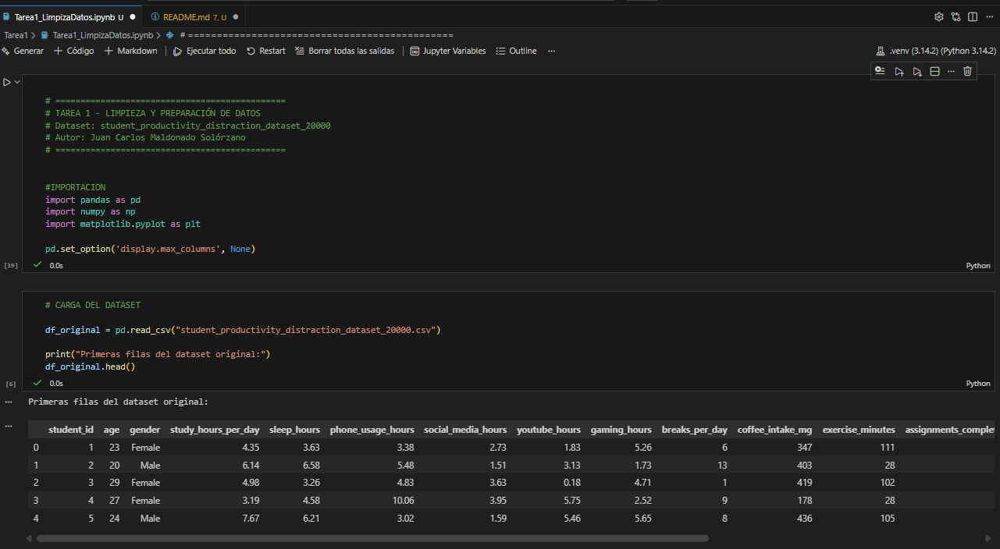

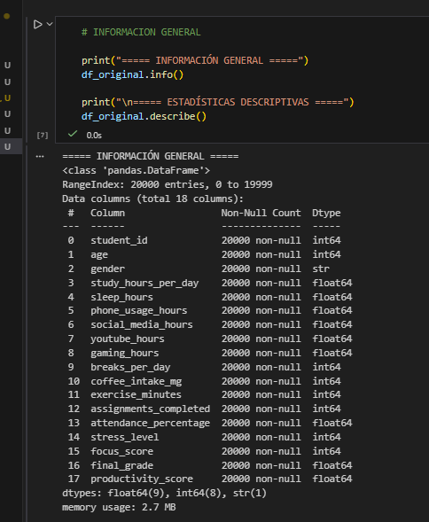

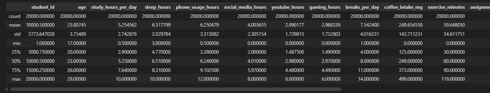

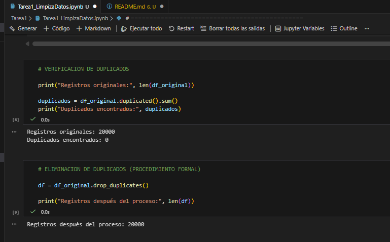

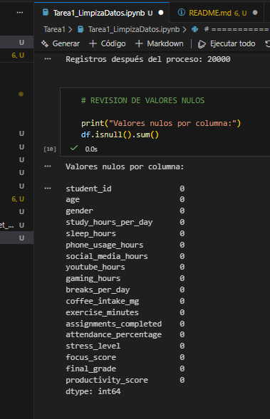

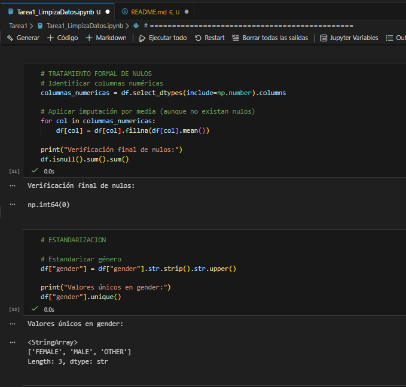

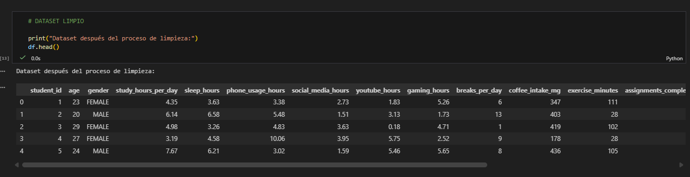

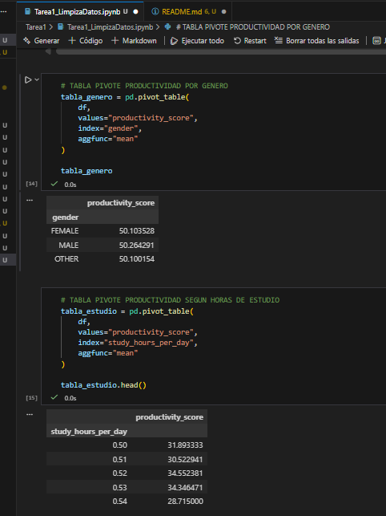

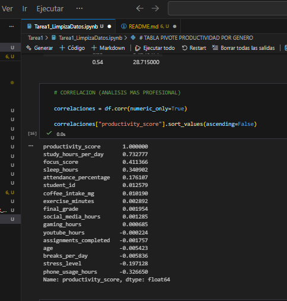

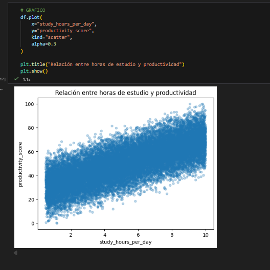

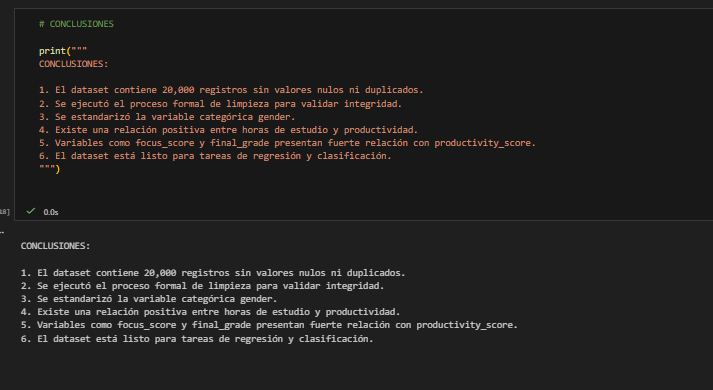
