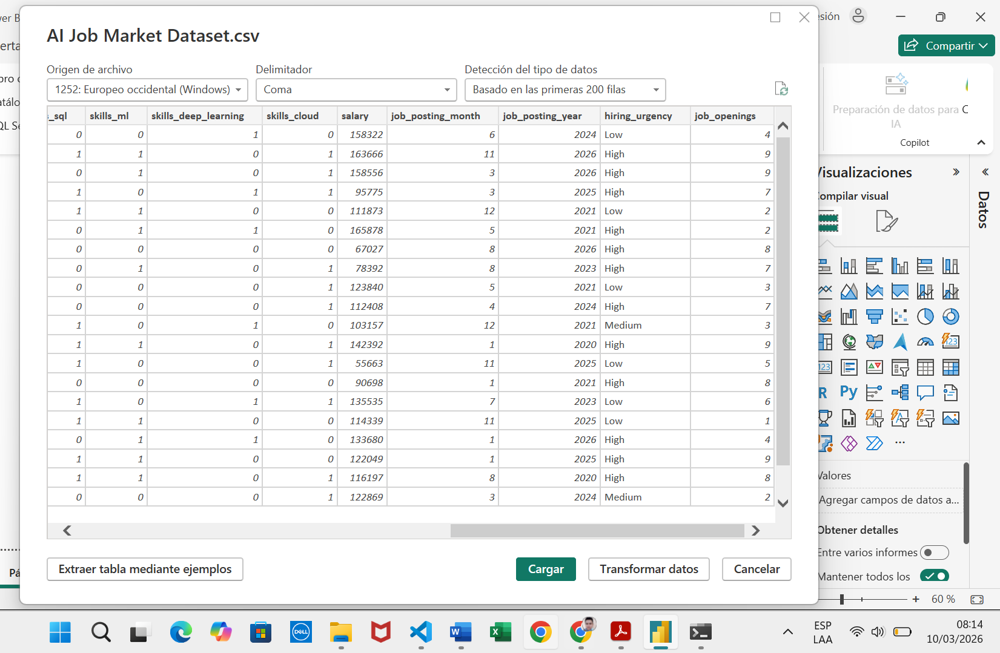
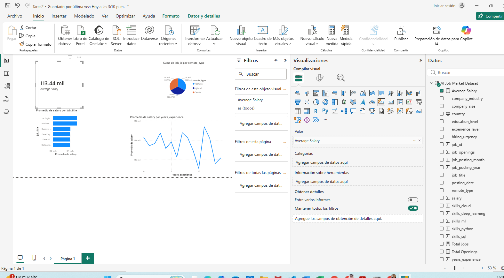
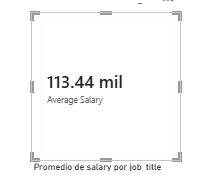
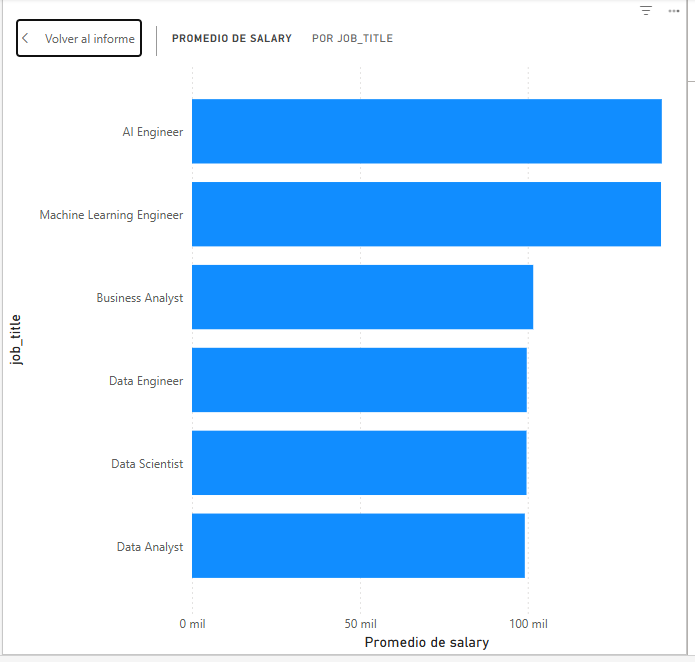
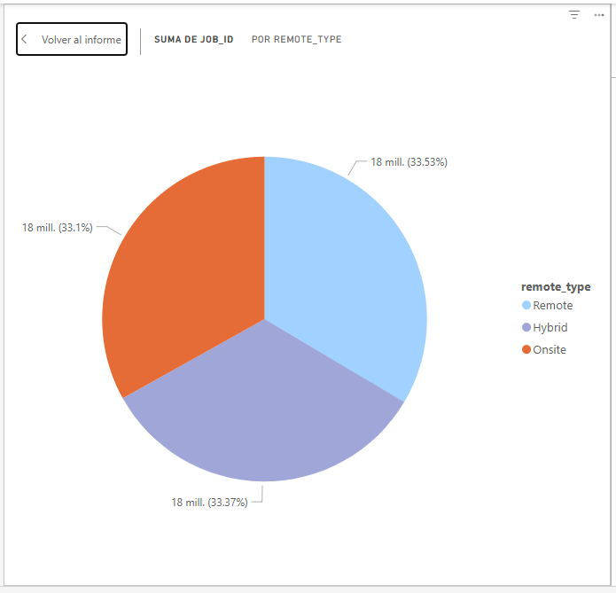
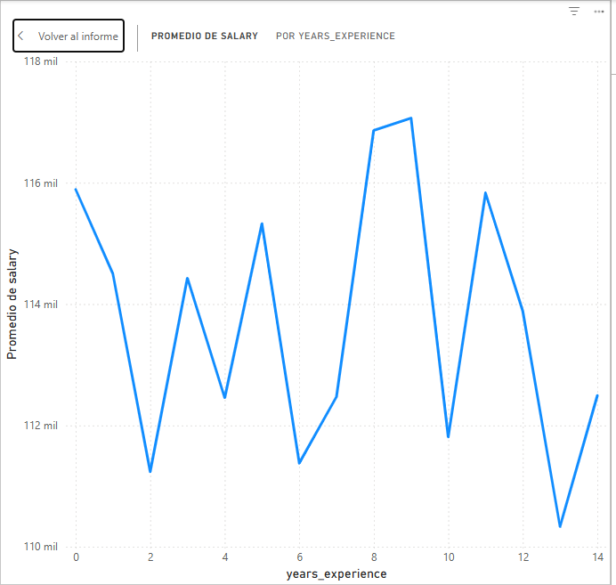
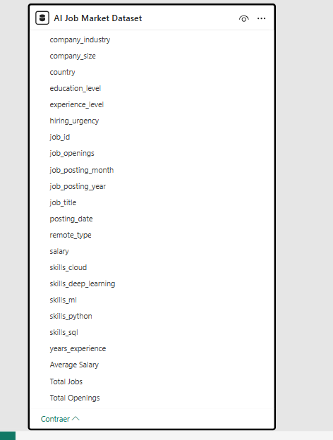
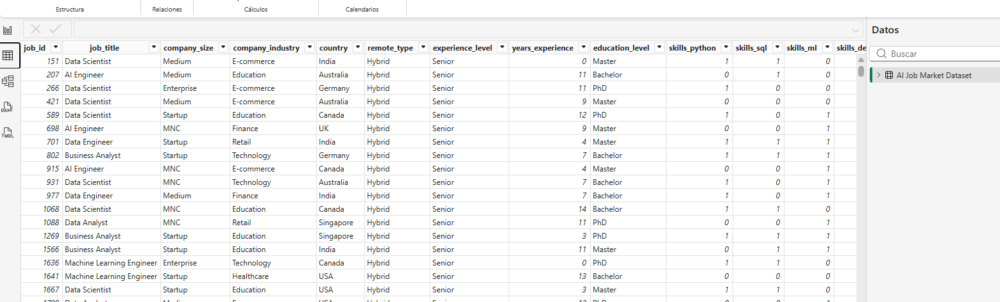

# Tarea 2 – Construcción de dashboard analitico en Power Bi

## Dataset Utilizado

Nombre: AI Job Market Dataset.csv
Total de registros: 10,345  
Total de columnas: 19  
Licencia: CC BY-NC-SA 4.0  

## Descripción

El conjunto de datos del mercado laboral de inteligencia artificial y ciencia de datos (2020-2026) es un conjunto de datos generado sintéticamente y diseñado para simular patrones de contratación del mundo real en el mercado laboral de inteligencia artificial y ciencia de datos.

El conjunto de datos contiene información estructurada sobre puestos de trabajo, características de las empresas, competencias técnicas requeridas, niveles de formación, experiencia requerida y rangos salariales. Refleja datos de contratación de diversos países, sectores y tamaños de empresas.

Este conjunto de datos está diseñado para respaldar el análisis de datos, el desarrollo de modelos de aprendizaje automático y proyectos de inteligencia empresarial.

El conjunto de datos se puede utilizar para:

Modelos de predicción salarial
Análisis de la demanda de empleo
Tareas de clasificación de aprendizaje automático
Análisis de la fuerza laboral
Análisis de tendencias de la demanda de habilidades
Proyectos de cartera de ciencia de datos
Todos los datos de este conjunto de datos se generan sintéticamente utilizando distribuciones estadísticas y aleatoriedad controlada, lo que garantiza la privacidad y mantiene patrones realistas.

## Proceso de Limpieza

### Eliminación de Duplicados

Se verificó la existencia de registros duplicados utilizando `duplicated()`.  
No se encontraron duplicados.

### Tratamiento de Valores Nulos

Se comprobó la presencia de valores faltantes.  
El dataset no contenía valores nulos.  
Se aplicó imputación por media como procedimiento formal.

### Estandarización

Se normalizó la variable `gender` a mayúsculas y se verificaron tipos de datos.

## Exploración

Se realizaron:

• Tabla pivote de productividad por género  
• Tabla pivote de productividad según horas de estudio  
• Análisis de correlación  
• Gráfico de dispersión  

## Interpretación

Se observa una relación positiva entre:

- study_hours_per_day y productivity_score
- focus_score y productivity_score
- final_grade y productivity_score

El dataset se encuentra limpio y listo para modelado predictivo.

